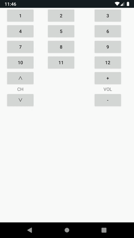

# Nature Remo Local API Sample for Android™

## 概要 / Overview

[Nature Remo](https://nature.global) から赤外線を送信する非公式の Android サンプルアプリです。  
[Nature Remo Local API](http://local.swagger.nature.global) v1.0.0 にて、 Panasonic 製テレビのリモコン信号を送信します。

## アプリ設計 / Architecture

* Kotlin Programming Language
* Model-View-ViewModel (MVVM)
* LiveData
* Data Binding

## オープンソースライセンス / Open source licenses

This software includes open source software:

* [Android Architecture Components](https://developer.android.com/topic/libraries/architecture) / [Apache License 2.0](http://www.apache.org/licenses/LICENSE-2.0)  
  by [The Android Open Source Project](https://source.android.com/)
* [Android Support Library](https://developer.android.com/topic/libraries/support-library/) / [Apache License 2.0](https://developer.android.com/license)  
  by [The Android Open Source Project](https://source.android.com/)
* [Guava: Google Core Libraries for Java](https://github.com/google/guava) / [Apache License 2.0](https://github.com/google/guava/blob/master/COPYING)  
  by [Google Open Source](https://opensource.google.com)
* [Kotlin Standard Library](https://kotlinlang.org/api/latest/jvm/stdlib/index.html) / [Apache License 2.0](http://www.apache.org/licenses/LICENSE-2.0)  
  by [JetBrains s.r.o.](https://www.jetbrains.com)
* [Retrofit](https://square.github.io/retrofit/) / [Apache License 2.0](https://square.github.io/retrofit/#license)  
  by [Square, Inc.](https://squareup.com/)
* [todo-mvvm-live-kotlin](https://github.com/googlesamples/android-architecture/tree/todo-mvvm-live-kotlin) - [Android Architecture Blueprints v1](https://github.com/googlesamples/android-architecture/tree/892088775e64cc5801bb488af2289e9e2e3a1fea) / [Apache License 2.0](https://github.com/googlesamples/android-architecture#license)  
  by [Google Inc.](https://www.google.com)

## ライセンス / License

    Copyright 2019 Satoki Mizoguchi

    Licensed under the Apache License, Version 2.0 (the "License");
    you may not use this file except in compliance with the License.
    You may obtain a copy of the License at

       http://www.apache.org/licenses/LICENSE-2.0

    Unless required by applicable law or agreed to in writing, software
    distributed under the License is distributed on an "AS IS" BASIS,
    WITHOUT WARRANTIES OR CONDITIONS OF ANY KIND, either express or implied.
    See the License for the specific language governing permissions and
    limitations under the License.

---

* Android は Google LLC の商標または登録商標です。
* Nature Remo は Nature Inc. の商標または登録商標です。
* その他、記載されている会社名、製品名、サービス名は、各社の商標または登録商標です。
